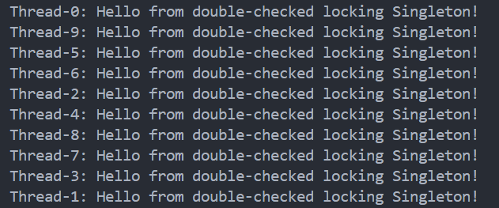
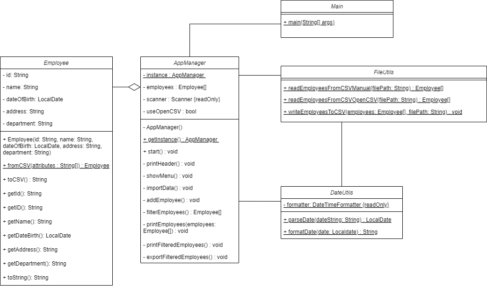
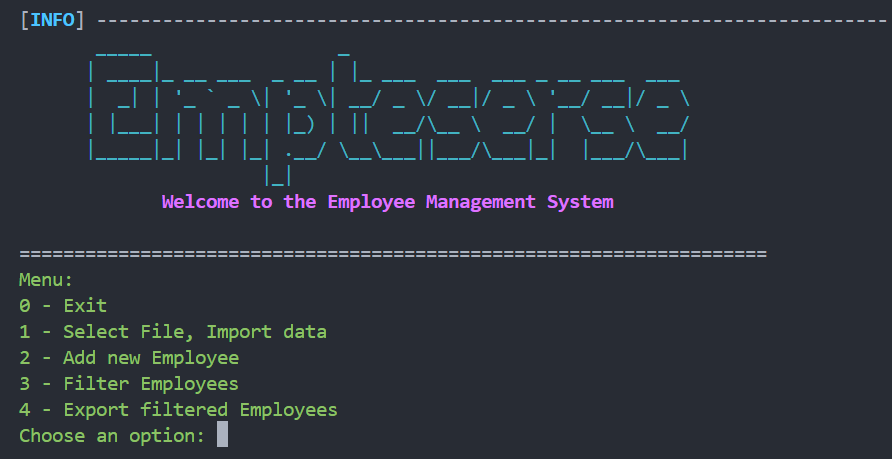

# 👨🏻‍🏫 Lecture 02 - Java Core
> This repository is created as a part of assignment for Lecture 02 - Java Core

## 🧵 Task 05 - Thead-safe singleton
A thread-safe singleton guarantees that a class has only one instance and provides a global point of access to that instance, even in programs with multiple tasks (threads) running at once. This is crucial in concurrent applications where multiple threads might try to create an instance of a class at the same time, leading to potential race conditions.

### 🔑 Key Concepts of Thread-Safe Singleton
1. **Singleton Pattern**
A class that allows only one instance to be created and provides a global point of access to that instance.
2. **Thread-Safety**
Ensuring that the singleton instance is created and accessed safely when multiple threads are involved, preventing race conditions and ensuring consistent behavior.

### 💻 Implementation
One way to implement a thread-safe singleton is using a method named **Double-Checked Locking**. Here's the implementation of `Singleton` class by modifying the Lazy implementation on slide using double-checked locking.

```java
class Singleton {
    // Volatile variable to ensure visibility of changes across threads
    private static volatile Singleton instance;

    // Private constructor to prevent instantiation from outside
    private Singleton() {}

    // Public method to provide access to the singleton instance
    public static Singleton getInstance() {
        // First check if instance is null without synchronization
        if (instance == null) {
            // Synchronize on the class to ensure only one thread creates the instance
            synchronized (Singleton.class) {
                // Double-check if instance is still null within synchronized block
                if (instance == null) {
                    instance = new Singleton();
                }
            }
        }

        return instance;
    }

    public String showMessage() {
        return "Hello from double-checked locking Singleton!";
    }

    public static void main(String[] args) {
        // Accessing the singleton instance
        Singleton singleton = Singleton.getInstance();
        System.out.println(singleton.showMessage());    // Outputs : Hello from double-checked locking Singleton!
    }
}
```

Additionally, here is how to access the Singleton in multi-threaded environment.

```java
// Task to run in each thread
class SingletonTestTask implements Runnable {
    @Override
    public void run() {
        // Obtain the singleton instance
        Singleton instance = Singleton.getInstance();
        
        // Print the instance and thread name
        System.out.println(Thread.currentThread().getName() + ": " + instance.showMessage());
    }
}

public class Main {
    public static void main(String[] args) {
        // Number of threads to create
        int threadCount = 10;
        
        // Create and start threads
        for (int i = 0; i < threadCount; i++) {
            Thread thread = new Thread(new SingletonTestTask(), "Thread-" + i);
            thread.start();
        }
    }
}
```

And the output will be something like this.



Here is the detail on what it actually does.
1. The `volatile` keyword ensures that changes to the `instance` variable are visible to all threads. This prevents the scenario where one thread sees a partially constructed object.
2. The constructor is private to prevent the instantiation of the class from outside the `Singleton` class, enforcing the singleton property.
3. The `getInstance` method provides the global point of access to the singleton instance.
    1. **First Check**: The `if (instance == null)` check is performed outside the synchronized block to avoid synchronization overhead once the instance is created.
    2. **Synchronized Block**: synchronized `(Singleton.class)` ensures that only one thread can execute this block at a time, preventing multiple threads from creating separate instances.
    3. **Double-Checked Locking**: Inside the synchronized block, if `(instance == null)` is checked again to make sure the instance is still null before creating a new one. This is necessary because the first check might have passed for multiple threads before any of them entered the synchronized block.

There is other way on implementing thread-safe singleton named **Bill Pugh Singleton**. Here's the implementation of `Singleton` class using Bill Pugh singleton.

```java
public class Singleton {
    // Private constructor to prevent instantiation.
    private Singleton() {}

    // Static inner helper class responsible for holding the Singleton instance
    private static class SingletonHelper {
        // The instance is created when the class is loaded
        private static final Singleton INSTANCE = new Singleton();
    }

    // Public method to provide access to the instance
    public static Singleton getInstance() {
        return SingletonHelper.INSTANCE;
    }
}
```

The `SingletonHelper` class is not loaded until the `getInstance()` method is called, providing lazy initialization. This approach does not require synchronization and ensures that the instance is created only when it's needed.

<br></br>

## 🔍 Task 06 - Passing Reference Types
Given on the slide, we have 2 different ways of passing reference types. Here is the modification in order to make it more readable.

```java
class MyClass {
    int value;
    String name;    // Add new string field
}

public class Main1 {
    // modifyObject method, Modify the object that the reference points to
    public static void modifyObject(MyClass x) {
        x.value = 10;
        x.name = "Modified Name";
    }

    public static void main(String[] args) {
        MyClass obj = new MyClass();
        obj.value = 5;
        obj.name = "Original Name";

        // Applying modifyObject method
        modifyObject(obj);
        System.out.println("obj.value after modifyObject: " + obj.value);
        // Output : obj.value after modifyObject: 10
        System.out.println("obj.name after modifyObject: " + obj.name);
        // Output : obj.name after modifyObject: Modified Name
    }
}

public class Main2 {
    // changeReference method, Cannot change the reference itself to point to a different object
    public static void changeReference(MyClass x) {
        x = new MyClass();  // This change the local reference, not the original reference
        x.value = 10;
        x.name = "Modified Name";
    }

    public static void main(String[] args) {
        MyClass obj = new MyClass();
        obj.value = 5;
        obj.name = "Original Name";

        // Applying changeReference method
        changeReference(obj);
        System.out.println("obj.value after changeReference: " + obj.value);
        // Output : obj.value after changeReference: 5
        System.out.println("obj.name after changeReference: " + obj.name);
        // Output : obj.name after changeReference: Original Name
    }
}
```

### ❓ What is actually happening?
1. **`modifyObject(MyClass x)` in class `Main1`**
    1. **Reference Passing**
    The reference `x` points to the same `MyClass` object in the heap as the `obj` reference in `main`. Modifying `x.value` or `x.name` changes the actual object in the heap.
    2. **Heap Update**
    Changes made to `x` are reflected in `obj` because both `x` and `obj` point to the same heap object.
2. **`changeReference(MyClass x)` in class `Main2`**
    1. **Reference Passing**
    Value `x` starts by pointing to the same object as `obj`. However, `x = new MyClass();` reassigns `x` to a new object in the heap. This new reference is local to the method and doesn't affect `obj`.
    2. **Local Update**
    Changes made to the new `x` do not affect the original `obj` reference, which still points to the initial object.

### 📊 Diagrammatic Explanation
Here is visualization on what is actually happening in Stack and Heap memory space.


Summary for Main1:
- `modifyObject` changes the contents of the object that both `obj` and `x` point to.
- `obj.value` becomes 10 and `obj.name` becomes "Modified Name".


Summary for Main2:
- `changeReference` only changes the local reference `x` within the method.
- The original object `obj` remains unaffected.
- `obj.value` remains 5 and `obj.name` remains "Original Name".

### ✏️ Conclusion
1. In class `Main1`, the `modifyObject` method directly modifies the object in the heap through the reference, affecting the original object. In this case, `modifyObject` modifies the same object that `obj` references because `x` points to the same heap location.
2. In class `Main2`, the `changeReference` method only reassigns the local reference within the method to a new object, leaving the original object untouched. In other word, `changeReference` reassigns `x` to a new object in the heap, so changes to `x` do not affect the original `obj`.

<br></br>

## 💡 Task 07 - Employee Management System
The project goal is to create employee management system on command-line based.

### 🌳 Project Structure
```bash
task7
├── data/
│   └── employees.csv
├── src/main/java/
│   ├── Main.java
│   ├── app/
│   │   └── AppManager.java
│   ├── model/
│   │   └── Employee.java
│   └── utils/
│       ├── DateUtils.java
│       └── FileUtils.java
└── pom.xml
```

### 🧩 Class Diagram
Here is the class diagram of the program



### ⚙️ How to run the program
1. Go to the `task7` directory by using this command
    ```bash
    $ cd task7
    ```
2. Make sure you have maven installed on your computer, use `mvn -v` to check the version, and then run this command
    ```bash
    $ mvn clean install
    ```
3. Finally, run the jar using this command
    ```bash
    $ java -jar target/employee_management-jar-with-dependencies.jar
    ```

If all the instruction is well executed, the main-view will be something like this.

